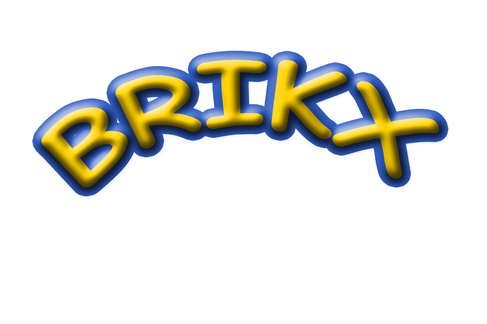

# 🎮 BRIKX - Modern Block Puzzle PWA

<div align="center">



**A stunning, feature-rich block puzzle game built with React**

**Developer:** Colin Nebula

[](https://web.dev/progressive-web-apps/)
[](https://reactjs.org/)
[](https://opensource.org/licenses/MIT)
[](SECURITY.md)

[Play Now](#-quick-start) • [Features](#-features) • [Installation](#-installation) • [Controls](#-controls) • [Security](#-security) • [Support](#-support-the-development)

</div>

---

## 📖 Table of Contents

- [Overview](#-overview)
- [Features](#-features)
- [Game Mechanics](#-game-mechanics)
- [Scoring System](#-scoring-system)
- [Quick Start](#-quick-start)
- [Installation](#-installation)
- [Controls](#-controls)
- [Tech Stack](#-tech-stack)
- [Game Logic](#-game-logic)
- [PWA Features](#-pwa-features)
- [Mobile Optimization](#-mobile-optimization)
- [Security](#-security)
- [Testing](#-testing)
- [Deployment](#-deployment)
- [Customization](#-customization)
- [Browser Support](#-browser-support)
- [Troubleshooting](#-troubleshooting)
- [Contributing](#-contributing)
- [Support the Development](#-support-the-development)
- [License](#-license)

---

## 🌟 Overview

**BRIKX** is a modern take on the classic block puzzle game, reimagined as a Progressive Web App with stunning visual effects, comprehensive game mechanics, and full mobile support. Built with React 19 and optimized for performance, BRIKX delivers a premium gaming experience across all devices.

### Why BRIKX?

- 🎨 **Gorgeous Visuals** - 5 dynamic themes, particle effects, and smooth animations
- 📱 **True PWA** - Install on any device, works offline, full-screen gameplay
- 🎮 **Universal Controls** - Keyboard, gamepad, and touch controls
- 🏆 **Advanced Scoring** - Combos, perfect clears, color matching bonuses
- ⚡ **High Performance** - 60fps gameplay with hardware acceleration
- 🎯 **Modern Features** - Hold piece, ghost piece, 5-piece preview
- 🔊 **Sound Effects** - Dynamic audio feedback (toggle on/off)

---

## ✨ Features

### 🎯 Core Gameplay

#### Advanced Mechanics
- **7-Bag Randomizer** - Fair piece distribution ensuring all 7 piece types appear before repeating
- **Hold Piece System** - Store current piece for strategic play (C key or Shift)
- **Ghost Piece Preview** - See exactly where your piece will land
- **5-Piece Next Queue** - Plan multiple moves ahead
- **Wall Kicks** - Advanced rotation system prevents stuck pieces
- **Soft & Hard Drop** - Fine control with arrow down (soft) or spacebar (hard)

#### Combo & Scoring
- **Combo Chain System** - Clear lines consecutively for exponential bonuses
- **Perfect Clear Detection** - 3000 bonus points for clearing entire board
- **Color Matching** - 50 points per block when 3+ same color blocks in a line
- **Full Line Bonus** - +500 points when entire line is same color
- **T-Spin Recognition** - Advanced move detection (coming soon)

#### Progressive Challenge
- **15+ Difficulty Levels** - Speed increases every 10 lines
- **Dynamic Speed Curve** - From 1000ms to 100ms drop intervals
- **Level-Based Themes** - Visual environment changes with progression
- **Increasing Challenge** - Maintains engagement throughout gameplay

### 🎨 Visual Excellence

#### Particle System
- **Multi-Ring Explosions** - Circular particle bursts with multiple layers
- **6 Particle Types** - Circles, stars, squares, diamonds, sparks, rings
- **Trail Effects** - Motion blur for enhanced particles
- **Glow & Pulse** - Dynamic lighting effects
- **Wave Animations** - Expanding ring waves on special clears

#### Dynamic Theming
**Purple Theme** (Levels 1-3)
- Background: Deep purple gradient
- Accent: Blue violet (#8a2be2)

**Blue Theme** (Levels 4-6)
- Background: Ocean blue gradient
- Accent: Deep sky blue (#0096ff)

**Magenta Theme** (Levels 7-9)
- Background: Hot pink gradient
- Accent: Magenta (#ff0080)

**Cyan Theme** (Levels 10-12)
- Background: Teal gradient
- Accent: Cyan (#00c8c8)

**Orange Theme** (Levels 13+)
- Background: Amber gradient
- Accent: Orange (#ff9600)

#### Visual Effects
- **Animated Grid** - Pulsing background with floating geometric shapes
- **Screen Shake** - Intensity-based on clear type
- **Score Popups** - Floating damage numbers with fade effects
- **Level Flash** - Celebratory animations on level up
- **Glass Morphism** - Modern UI with backdrop blur
- **3D Block Design** - Specular highlights, shadows, and gradients

### 📱 PWA Capabilities

- ✅ **Installable** - Add to home screen on iOS, Android, and desktop
- ✅ **Offline Play** - Full functionality without internet after first load
- ✅ **Full Screen Mode** - Immersive borderless experience
- ✅ **Service Worker** - Smart caching for instant loading
- ✅ **App-Like Experience** - Runs in standalone window
- ✅ **Cross-Platform** - One codebase, works everywhere

### 🎮 Control Options

#### Keyboard Controls
- **← →** : Move left/right
- **↓** : Soft drop (faster fall)
- **↑** : Rotate clockwise
- **SPACE** : Hard drop
- **C/SHIFT** : Hold piece
- **P/ESC** : Pause

#### Gamepad Support
- Full PS4/PS5 and Xbox controller support
- D-Pad / Left Stick for movement
- Auto-detection and pairing

#### Touch Controls (Mobile)
- On-screen buttons for all actions
- Optimized for mobile gameplay
- No lag or delay

### 👤 Player Profile

- **16 Avatar Options** - 🎮 👾 🕹️ 🎯 ⭐ 🔥 💎 👑 🚀 ⚡ 🌟 💫 🎪 🎨 🎭 🦄
- **Custom Display Name** - Up to 15 characters
- **High Score Tracking** - Personal best automatically saved

---

## 🎲 Game Mechanics

### Piece Generation

BRIKX uses the industry-standard **7-Bag Randomizer** system:

1. All 7 piece types (I, O, T, S, Z, J, L) are placed in a "bag"
2. Pieces are randomly shuffled using Fisher-Yates algorithm
3. Pieces are drawn from the bag one by one
4. When bag is empty, a new shuffled bag is created
5. This ensures fair distribution

### Collision Detection

- **Per-Block Checking** - Each block tested individually
- **Boundary Detection** - Prevents movement outside 10×20 grid
- **Overlap Prevention** - Checks against placed blocks
- **Wall Kick** - Attempts adjustments on rotation
- **Ceiling Check** - Game over detection

### Line Clearing

**Clear Detection:**
1. Scan all rows after piece placement
2. Identify rows with all 10 columns filled
3. Calculate bonuses (color match, combo, perfect clear)
4. Animate clearing rows with particles
5. Remove cleared rows and drop remaining blocks

**Combo System:**
- Starts at 1 on first clear
- Increments for consecutive clears
- Resets when no lines cleared
- Bonus: 50 × level × combo

### Gravity & Speed

**Drop Interval:**
```
dropInterval = max(100, 1000 - (level - 1) * 100)
```

- Level 1: 1000ms
- Level 5: 600ms
- Level 10+: 100ms (maximum speed)

---

## 🏆 Scoring System

### Base Line Clear Points

| Lines | Base Score | Example (Level 5) |
|-------|-----------|-------------------|
| Single | 100 × level | 500 points |
| Double | 300 × level | 1,500 points |
| Triple | 500 × level | 2,500 points |
| Brikx | 800 × level | 4,000 points |

### Bonus Multipliers

**Combo Bonus:** 50 × level × combo_count  
**Color Match:** 50 points per block (3+ same color)  
**Full Line:** Additional 500 points  
**Perfect Clear:** 3,000 bonus points  
**Hard Drop:** 2 points per row

### Example Calculation

**Brikx at Level 8 with 2-combo:**
```
Base: 800 × 8 = 6,400
Combo: 50 × 8 × 2 = 800
Color Match: 50 × 4 = 200
Hard Drop: 2 × 10 = 20
Total: 7,420 points
```

---

## 🚀 Quick Start

### Prerequisites
- Node.js 14+ and npm 6+
- Modern web browser

### Development Setup

```bash
# Install dependencies
npm install

# Start development server
npm start
```

Open [http://localhost:3000](http://localhost:3000) to play!

### Production Build

```bash
# Create optimized build
npm run build

# Serve locally
npx serve -s build
```

---

## 📱 Installation

### iOS (iPhone/iPad)
1. Open BRIKX in **Safari**
2. Tap **Share** button
3. Select **"Add to Home Screen"**
4. Tap **"Add"**

### Android (Chrome)
1. Open BRIKX in **Chrome**
2. Tap **menu** (⋮)
3. Select **"Install App"**
4. Tap **"Install"**

### Desktop
1. Look for **install icon** (⊕) in address bar
2. Click **"Install"**
3. Launch from desktop

---

## 🎮 Controls

### Keyboard
| Key | Action |
|-----|--------|
| ← → | Move left/right |
| ↓ | Soft drop |
| ↑ | Rotate |
| SPACE | Hard drop |
| C/SHIFT | Hold piece |
| P/ESC | Pause |

### Gamepad
- D-Pad / Left Stick: Move
- A/X Button: Hard drop
- B/Circle/Up: Rotate
- Start: Pause

### Touch (Mobile)
- ↻ : Rotate
- ◀ ▼ ▶ : Move/drop
- HOLD : Hold piece
- DROP : Hard drop

---

## 🛠️ Tech Stack

### Core
- **React 19.2.3** - UI framework
- **Canvas API** - Game rendering
- **Web Audio API** - Sound synthesis
- **Service Workers** - Offline support
- **localStorage** - Save persistence

### APIs Used
- Gamepad API - Controller input
- Touch Events - Mobile gestures
- RequestAnimationFrame - Smooth rendering

---

## 🧠 Game Logic

### Core Game Loop

```javascript
const gameLoop = (timestamp) => {
  // Calculate delta time
  const deltaTime = timestamp - lastTime;
  
  // Handle input
  handleGamepadInput();
  
  // Apply gravity
  if (dropCounter > dropInterval) {
    moveDown();
    dropCounter = 0;
  }
  
  // Render
  draw();
  
  // Continue loop
  requestAnimationFrame(gameLoop);
};
```

### State Management

```javascript
gameState = {
  board: Array(20).fill().map(() => Array(10).fill(0)),
  currentPiece: { shape, color, type },
  nextPieces: [piece1, piece2, ...],
  holdPiece: null,
  particles: [],
  scorePopups: []
}
```

### Collision Detection

```javascript
const checkCollision = (board, piece, x, y) => {
  for (let row of piece.shape) {
    for (let cell of row) {
      if (cell) {
        // Check boundaries and board
        if (outOfBounds || boardCollision) {
          return true;
        }
      }
    }
  }
  return false;
};
```

---

## 🌐 PWA Features

### Service Worker Caching

**Cache-First Strategy:**
- HTML, JS, CSS files
- Manifest and icons
- Static assets

### Offline Capabilities

- ✅ Play without internet
- ✅ Save high scores locally
- ✅ Profile persists
- ✅ Fast loading from cache

---

## 📱 Mobile Optimization

### Responsive Breakpoints

**Desktop (> 768px):**
- Full canvas (560×600px)
- Keyboard controls

**Tablet (481-768px):**
- Canvas scaled 0.7x
- 70px touch buttons

**Phone (< 480px):**
- Canvas scaled 0.5x
- 60px touch buttons

### Touch Layout

```
┌─────────────────┐
│   Game Canvas   │
├─────────────────┤
│ [↻]     [HOLD]  │
│         [DROP]  │
│ [◀][▼][▶]      │
└─────────────────┘
```

---

## 🔒 Security

BRIKX implements comprehensive security measures to protect users from malware, tampering, and misuse.

### Security Features

✅ **Content Security Policy (CSP)** - Prevents XSS attacks and unauthorized scripts  
✅ **Input Sanitization** - All user inputs validated (15-char limit, alphanumeric only)  
✅ **localStorage Protection** - Size limits, type checking, error handling  
✅ **No External Dependencies** - Pure React, no third-party scripts  
✅ **Service Worker Integrity** - Versioned cache prevents tampering  
✅ **Security Headers** - X-Frame-Options, X-Content-Type-Options, XSS-Protection  
✅ **No eval()** - Code execution vulnerabilities eliminated  
✅ **Automated Auditing** - Pre-build security scans  

### Security Audit

Run before pushing to GitHub:

```bash
# Run security audit
npm run security-audit

# Full preparation (includes npm audit)
npm run prepare-github
```

**What it checks:**
- Scans for API keys, secrets, credentials
- Validates security headers
- Checks service worker security
- Reviews localStorage operations
- Detects unsafe code patterns
- Generates SECURITY_AUDIT.json report

### Automated Protection

Security audit runs automatically before every build:

```bash
npm run build  # Runs security-audit first
```

### Security Policy

For detailed security information, vulnerability reporting, and best practices:

📄 **[Read Full Security Policy](SECURITY.md)**

Key points:
- Report vulnerabilities via email (not public issues)
- Response within 48 hours
- Critical fixes within 24-48 hours
- See SECURITY.md for complete guidelines

---

## 🧪 Testing

### Lighthouse Audit
1. Open DevTools (F12)
2. Lighthouse tab
3. Select "Progressive Web App"
4. Target: 90+ score

### Offline Test
1. Load app online
2. Enable offline mode in DevTools
3. Refresh - should still work

### Mobile Test
```bash
# Find IP
ipconfig

# Access from mobile
http://YOUR-IP:3000
```

---

## 🚀 Deployment

### Recommended Platforms

**Netlify** (Easiest)
```bash
npm run build
# Drag 'build' folder to netlify.com
```

**Vercel**
```bash
npm run build
npx vercel
```

**GitHub Pages**
- Set homepage in package.json
- Deploy build folder

### Requirements
- ✅ HTTPS enabled
- ✅ Service worker support
- ✅ Modern browser

---

## 🎨 Customization

### Change App Name

**manifest.json:**
```json
{
  "short_name": "YourGame",
  "name": "Your Game Name"
}
```

### Modify Colors

**DriftRacer.css:**
```css
.drift-racer {
  background: linear-gradient(
    135deg,
    #your-color,
    #your-end-color
  );
}
```

### Custom Icons
1. Design 512×512px icon
2. Use `generate-icons.html`
3. Replace in public folder

---

## 🌐 Browser Support

| Browser | Support |
|---------|---------|
| Chrome | ✅ Full |
| Firefox | ✅ Full |
| Safari | ✅ Full (iOS 11.3+) |
| Edge | ✅ Full |
| Opera | ✅ Full |
| IE11 | ❌ Not supported |

---

## 🐛 Troubleshooting

### PWA Not Installing
- ✅ Ensure HTTPS enabled
- ✅ Check manifest valid
- ✅ Verify service worker registered
- ✅ Clear cache and retry

### Touch Controls Missing
- ✅ Check screen width < 768px
- ✅ Verify mobile detection
- ✅ Look for console errors

### Offline Not Working
- ✅ Load online first
- ✅ Check service worker active
- ✅ Verify cache storage

### High Scores Not Saving
- ✅ Check localStorage enabled
- ✅ Not in private mode
- ✅ Clear storage and retry

---

## 🤝 Contributing

Contributions welcome! Ideas:
- Background music
- Achievement system
- Multiplayer mode
- Statistics tracking
- Custom themes
- Leaderboards

### How to Contribute

1. Fork repository
2. Create feature branch
3. Commit changes
4. Push to branch
5. Open Pull Request

---

## 💖 Support the Development

If you enjoy BRIKX, consider supporting continued development!

### Donation Options

<div align="center">

[](https://paypal.me/yourusername)

[](https://ko-fi.com/yourusername)

[](https://github.com/sponsors/yourusername)

</div>

### Ways to Support

💰 **One-Time Donation**
- PayPal: [paypal.me/yourusername](https://paypal.me/yourusername)
- Ko-fi: [ko-fi.com/yourusername](https://ko-fi.com/yourusername)

🌟 **Monthly Support**
- GitHub Sponsors: [github.com/sponsors/yourusername](https://github.com/sponsors/yourusername)

⭐ **Free Ways to Support**
- Star this repository
- Share with friends
- Report bugs
- Contribute code

### What Your Support Enables

- 🚀 New features and modes
- 🐛 Bug fixes
- 📱 Better optimization
- 🎨 More themes
- 🔊 Enhanced audio
- 📖 Documentation
- 🌍 Community features

### Recognition

Sponsors recognized in:
- GitHub repository
- In-game credits (coming soon)
- Annual showcase

**Special thanks to all supporters!**

---

## 📁 Project Structure

```
nebula-r/
├── public/
│   ├── index.html
│   ├── manifest.json
│   ├── service-worker.js
│   └── Brikx-Title.png
├── src/
│   ├── App.js
│   ├── DriftRacer.js      # Main game (2000+ lines)
│   ├── DriftRacer.css     # Styles (2500+ lines)
│   └── index.js
├── build/                  # Production build
└── README.md
```

---

## 📄 License

MIT License - Copyright (c) 2025 BRIKX

Permission granted to use, copy, modify, merge, publish, distribute, sublicense, and/or sell copies of the Software.

See full license text in repository.

---

## 🙏 Acknowledgments

- React Team - Amazing framework
- MDN Web Docs - API documentation
- PWA Community - Best practices
- Open Source Contributors
- Players - Feedback and support

---

## 📞 Contact

- 🌐 **Website:** [Your Website](https://www.nebula3ddev.com)
- 📧 **Email:** info@www.nebula3ddev.com


---

<div align="center">

## 🎮 Play BRIKX Today!

**The perfect blend of classic gameplay and modern technology!**

[🎮 Play Now](https://your-deployment-url.com) • [⬇️ Install](#-installation) • [💖 Support](#-support-the-development)

---

**Built with ❤️ by Colin Nebula**

*Last Updated: December 2025*

</div>
